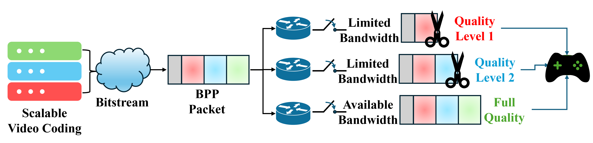

# 🎮 QoE Evaluation of BPP Packet Wash Using ROI-based Scalable Video Coding


 
This repository contains resources to evaluate the Packet Wash technique for scalable video streaming with the gblurring technique for defining the ROI, especially in gaming scenarios.
Requirements

To use this repository, please ensure the following dependencies are installed:
### 1. 🧩 JSVM (H264 Reference Software)

Scalable H.264 reference software provided by Fraunhofer HHI.

    Download version 9_19_15 from the official JVET Git repository:
    🔗 https://vcgit.hhi.fraunhofer.de/jvet/jsvm

### 2. 🎥 FFmpeg

FFmpeg is required for video processing and visual quality assessments.

    Download FFmpeg from:
    🔗 https://ffmpeg.org/download.html

Ensure your FFmpeg build includes the following filters:

    PSNR (Peak Signal-to-Noise Ratio)

    SSIM (Structural Similarity Index)

    VMAF (Video Multi-Method Assessment Fusion)

Alternatively, you can use the standalone VMAF tool from Netflix:

    🔗 https://github.com/Netflix/vmaf

### 3. 🧪 Packet Wash Implementation

This project uses the Packet Wash implementation developed by Stuart Clayman.

    🔗 https://github.com/stuartclayman/h264_over_bpp/

## 🔧 Additional Utilities

If you need to downscale the video for any reason, you can may want to use `./DownConvertStatic` provided in JSVM, but this is only one way of doing it.

    ./DownConvertStatic [width] [height] [location]/[file_original].yuv [width] [height] [location]/[file_downsize].yuv

If you want to lower the framerate which might be needed, you can use ffmpeg as follows:

    ffmpeg -s [width]x[height] -pix_fmt yuv420p -framerate 60 -i [location]/[file_high_fps].yuv -vf "select='not(mod(n\,2))'" -fps_mode passthrough -f rawvideo [location]/[file_low_fps].yuv

## 📊 Quality Assessment

To evaluate the visual quality impact of the Packet Wash technique, this repository supports three standard metrics:

-PSNR

    ffmpeg -s [width]x[height] -i location]/[file_high_fps].yuv -s [width]x[height] -i [location]/[file_low_fps].yuv -lavfi "psnr" -f null -

-SSIM

    ffmpeg -s [width]x[height] -i location]/[file_high_fps].yuv -s [width]x[height] -i [location]/[file_low_fps].yuv -lavfi "ssim" -f null -

-VMAF

    vmaf --reference [location]/[file_high_fps].yuv --distorted [location]/[file_low_fps].yuv --width [width] --height [height] --bitdepth 8 --pixel_format 420 --model "path=[vmaf_location]/vmaf-3.0.0/model/vmaf_4k_v0.6.1.json" --threads 12 --output [location]/*.csv --csv --frame_cnt 300 --quiet

-FrameDiff

    python subjective_evaluation.py [location]/[noWash].yuv [location]/[Washed_QL1].yuv [location]/[Washed_QL2].yuv [width] [height] 300


## 📁 Folder Overview

- 📁 [`confs`](./confs): Contains configuration files used for Scalable Video Coding (SVC).
- 📁 [`results`](./results): Includes the results before and after applying the Packet Wash technique.

## 🙏 Acknowledgements
Thanks to Nabajeet Barman for providing the high-resolution gaming videos, available at: ```github.com/NabajeetBarman/GamingHDRVideoSET``` and ```N. Barman , M. G. Martini, ``User Generated HDR Gaming Video Streaming: Dataset, Codec Comparison, and Challenges,,'' in IEEE Transactions on Circuits and Systems for Video Technology, vol. 32, no. 3, pp. 1236-1249, March 2022, doi: 10.1109/TCSVT.2021.3077384.```

Thanks to Stuart Clayman for the BPP (Big Packet Protocol) implementation, available at: ```github.com/stuartclayman/h264_over_bpp``` and ```S. Clayman and M. Sayıt, ``Low Latency Low Loss Media Delivery Utilizing In-network Packet Wash,'' J. Netw. Syst. Manage., vol. 31, no. 1, Jan. 2023, pp. 1--31, doi: 10.1007/s10922-022-09712-1.```

This study was funded by ```PEPR Network of Future```, subproject Networks Architectures & In frastructure.


    
